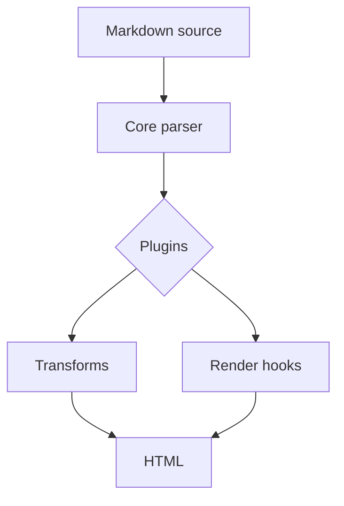

# Markdown Kitchen Sink

[[toc]]

This document is intentionally dense. It should render cleanly with the kitchen-sink plugin set and still remain readable when a plugin is disabled.

::frontmatter
title: Markdown Kitchen Sink
author: Nizel Renderer Test
date: 2026-07-02
status: Fixture
::
::

*[HTML]: HyperText Markup Language
*[CSS]: Cascading Style Sheets
*[API]: Application Programming Interface

## Inline Markdown

This paragraph contains **bold text**, *italic text*, ***bold italic text***, ~~struck text~~, `inline code`, ==highlighted text==, H~2~O, E = mc^2^, and escaped characters like \*not italic\*, \`not code\`, and \[not a link\].

Abbreviations should work in normal copy: HTML, CSS, and API.

Emoji shortcodes should render outside code: :check: :warning: :memo: :bulb: :rocket: :tada:

Unknown emoji shortcodes should stay readable: :not-a-real-shortcode:

Smart punctuation source stays plain Markdown-friendly: "quotes", 'apostrophes', ellipses..., en-dash -- and em-dash ---.

A paragraph with a hard line break.  
This line should appear directly below the previous one.

A paragraph with a soft line break.
This line may wrap as part of the same paragraph depending on renderer behavior.

## Links, Autolinks, and References

Inline link: [Nizel docs](https://example.com/docs "Documentation")

Reference link: [Plugin guide][plugin-guide]

Bare URL autolink: https://example.com/very/long/path/that/should/wrap/properly/without/breaking/the/page?query=markdown-renderer-test&mode=kitchen-sink

Email autolink: support@example.com

Angle URL autolink: <https://example.com/angle>

Angle email autolink: <hello@example.com>

[plugin-guide]: https://example.com/plugins

## Lists

- First unordered item
- Second unordered item
  - Nested item with **strong text**
  - Nested item with `inline code`
    - Deeply nested item
- Final unordered item

1. First ordered step
2. Second ordered step
   1. Nested ordered step
   2. Another nested ordered step
3. Third ordered step

- This list item has multiple paragraphs.

  This is the second paragraph inside the same list item, with a [link](https://example.com).

- [x] Render headings
- [x] Render paragraphs
- [x] Render tables
- [x] Render plugin blocks
- [ ] Review visual spacing
  - [x] Nested task item
  - [ ] Nested pending task

## Definition Lists

Renderer
: Converts parsed Markdown into output HTML.

Plugin
: Adds parsing, rendering, transforms, or hooks.
: Should stay deterministic in benchmark runs.

Fixture
: A representative document used to compare behavior.

## Blockquotes

> This is a simple blockquote with **bold text** and a [link](https://example.com).

> Nested blockquote:
>
> > This is inside another blockquote.
> >
> > > This is deeply nested and should still be legible.

## Alerts

> [!NOTE]
> GitHub-style alert blockquotes should become plugin alert blocks.

> [!TIP]
> Use this fixture when changing parsing, rendering, or plugin ordering.

> [!IMPORTANT]
> The kitchen sink should use supported syntax only.

> [!WARNING]
> Unsafe raw HTML should not be required for this fixture to look correct.

> [!CAUTION]
> Do not assume every Markdown engine understands every extension.

::tip Custom Alert
Custom alert blocks should support **Markdown** inside their body.
::

## Details

:::details Release checklist
- Confirm the build passes.
- Check the generated HTML for plugin output.
- Keep benchmark fixtures deterministic.
:::

:::details
The default summary should be supplied by the details plugin.
:::

## Media

Standalone images should be enhanced by the media plugin.


Inline images should remain inline: before  after.

[](https://example.com/image-link)

## Tables

| Feature | Example | Expected behavior |
| :--- | :---: | ---: |
| Bold | **Important** | Strong text |
| Code | `const value = 1` | Monospace |
| Link | [Visit](https://example.com) | Clickable |
| Strike | ~~Removed~~ | GFM-style delete |
| Mark | ==Highlighted== | Typography plugin |

| Package | Category | Enabled here |
| --- | --- | --- |
| `nizel-plugin-abbr` | inline | yes |
| `nizel-plugin-alert` | block | yes |
| `nizel-plugin-autolink` | inline | yes |
| `nizel-plugin-citations` | inline | yes |
| `nizel-plugin-code-copy` | code wrapper | yes |
| `nizel-plugin-deflist` | block | yes |
| `nizel-plugin-details` | block | yes |
| `nizel-plugin-diagrams` | explicit code transform | yes |
| `nizel-plugin-emoji` | inline | yes |
| `nizel-plugin-footnotes` | block | yes |
| `nizel-plugin-frontmatter-ui` | block | yes |
| `nizel-plugin-heading-anchors` | heading | yes |
| `nizel-plugin-math` | inline/block | yes |
| `nizel-plugin-media` | render hook | yes |
| `nizel-plugin-sanitize` | render hook | yes |
| `nizel-plugin-shiki` | code renderer | yes |
| `nizel-plugin-toc` | block | yes |
| `nizel-plugin-typography` | inline | yes |

## Code

Inline code should preserve plugin-looking text: `:rocket: ==mark== $x$ <script>`.

Code with backticks inside: ``Use `code` inside a sentence.``

```ts filename="renderer.ts" {2,5-6}
type DocumentStatus = "draft" | "published" | "archived";

export function publish(status: DocumentStatus): DocumentStatus {
  const next = status === "draft" ? "published" : status;
  console.log("status", next);
  return next;
}
```

```diff
- const renderer = "old";
+ const renderer = "nizel";
```

```json
{
  "plugins": ["abbr", "alert", "code-copy", "diagrams", "shiki", "typography"],
  "safe": true
}
```

## Math

Inline math should wrap TeX source: $E = mc^2$ and $\alpha + \beta = \gamma$.

Display math should become a block wrapper:

$$
f(x) = \int_{-\infty}^{\infty} e^{-x^2} dx
$$

## Diagrams



## Footnotes and Citations

This sentence has a simple footnote.[^simple]

This sentence has a longer note with punctuation inside it.[^long]

This sentence cites a source [@smith2026] and another source [@nizel].

Unknown footnotes and citations should remain readable: [^missing] [@missing].

[^simple]: This is a simple footnote.

[^long]: This footnote contains punctuation, commas, and a URL: https://example.com/footnote.

[@smith2026]: Smith, A. Markdown Rendering Notes, 2026.
[@nizel]: Nizel Project, First-party Plugin Fixture.

## Safety and Edge Cases

Unsafe inline HTML should be escaped in safe mode: <script>alert("xss")</script>

Attribute-looking text should stay text: onclick="alert(1)" javascript:alert(1)

Raw semantic HTML is intentionally not required for this fixture, because safe rendering is the default.

ThisIsAnExtremelyLongWordWithoutSpacesThatShouldTestWrappingBehaviorInTheRendererAndShouldNotBreakTheLayoutEvenInNarrowColumns.

Ampersand: &

Less than: <

Greater than: >

Escaped less than: \<

Escaped greater than: \>

Paragraph before empty space.


Paragraph after multiple empty lines.

---

***

___

\*asterisks\*

\_underscores\_

\# heading marker

\[link text\]\(url\)

\`inline code\`
