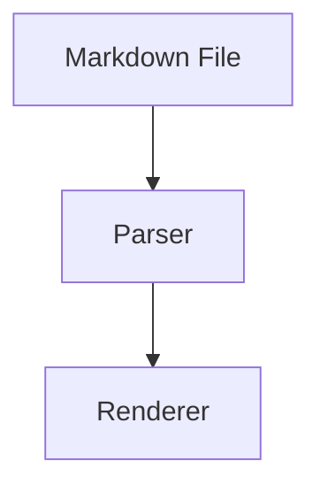

# Markdown Kitchen Sink

This file tests common Markdown features, GitHub Flavored Markdown, and a few optional extensions.

## Typography

This paragraph contains **bold text**, *italic text*, ***bold italic text***, ~~strikethrough text~~, `inline code`, <kbd>Cmd</kbd> + <kbd>K</kbd>, ==highlighted text==, H~2~O, E = mc^2^, and escaped characters like \*not italic\* and \`not code\`.

Emoji test: ✅ ⚠️ 📄 🧩

A paragraph with a hard line break.  
This line should appear directly below the previous one.

A paragraph with a soft line break.
This line may wrap as part of the same paragraph depending on renderer behavior.

---

## Lists

- First item
- Second item
  - Nested item
  - Another nested item
    - Deeply nested item
- Fourth item

1. First step
2. Second step
   1. Nested step
   2. Another nested step
3. Third step

- This list item has multiple paragraphs.

  This is the second paragraph inside the same list item.

Term
: Definition of the term.

Another term
: First definition.
: Second definition.

## Task Lists

- [x] Render headings
- [x] Render paragraphs
- [x] Render tables
- [ ] Render footnotes
- [ ] Render diagrams
- [ ] Render math
  - [x] Inline math
  - [ ] Block math

## Blockquotes

> This is a simple blockquote.

> Nested blockquote:
>
> > This is inside another blockquote.
> >
> > > This is deeply nested.

## Links and Images

Inline link: [Example](https://example.com)

Reference link: [OpenAI][openai]

Autolink: <https://example.com>

Email autolink: <hello@example.com>


[](https://example.com)

[openai]: https://openai.com

## Tables

| Left aligned | Center aligned | Right aligned |
|:---|:---:|---:|
| Apple | iOS | EUR 99 |
| Google | Android | EUR 25 |
| Web | Browser | EUR 0 |

| Feature | Example | Notes |
|---|---|---|
| Bold | **Important** | Should render strongly |
| Code | `const value = 1` | Monospace |
| Link | [Visit](https://example.com) | Clickable |
| Strike | ~~Removed~~ | Optional in GFM |

## Code

Inline code: `npm run build`

Code with backticks inside: ``Use `code` inside a sentence.``

```ts
type DocumentStatus = "draft" | "published" | "archived";

export function publish(status: DocumentStatus): DocumentStatus {
  return status === "draft" ? "published" : status;
}
```

```diff
- const renderer = "old";
+ const renderer = "nizel";
```

## Details

<details>
<summary>Click to expand</summary>

This content is hidden by default.

- First hidden item
- Second hidden item

</details>

## Footnotes

This sentence has a footnote.[^simple]

[^simple]: This is a simple footnote.

## Math

Inline math: $E = mc^2$

Block math:

$$
f(x) = \int_{-\infty}^{\infty} e^{-x^2} dx
$$

## Diagrams



## Callouts

> [!NOTE]
> This is a note. Use it for neutral supporting information.

> [!TIP]
> This is a tip. Use it for helpful advice.

> [!IMPORTANT]
> This is important. It should stand out more than normal text.

> [!WARNING]
> This is a warning. Use it for risky or surprising information.

> [!CAUTION]
> This is a caution. Use it for destructive or irreversible actions.

## Raw HTML

<div>
  <p>This paragraph is written in raw HTML.</p>
  <p><strong>Bold HTML</strong>, <em>italic HTML</em>, and <code>inline HTML code</code>.</p>
</div>

<figure>
  
  <figcaption>A figure with caption.</figcaption>
</figure>

## Edge Cases

ThisIsAnExtremelyLongWordWithoutSpacesThatShouldTestWrappingBehaviorInTheRendererAndShouldNotBreakTheLayoutEvenInNarrowColumns.

https://example.com/very/long/path/that/should/wrap/properly/without/breaking/the/page/or/overflowing/the/container?query=markdown-renderer-test&mode=kitchen-sink

Ampersand: &
Less than: <
Greater than: >
Escaped less than: \<<br>
Escaped greater than: \>

Paragraph before empty space.


Paragraph after multiple empty lines.

---

***

___

\*asterisks\*
\_underscores\_
\# heading marker
\[link text\]\(url\)
\`inline code\`
