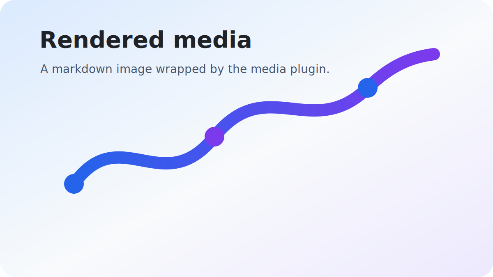
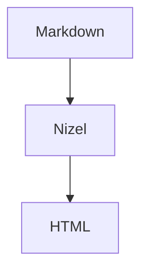

# Nizel Style Preview

This page previews the scoped Nizel content styles, core markdown elements, and the first-party plugin classes that can be loaded as one stylesheet or as separate plugin CSS files.

The preview is written as Markdown and rendered through Nizel with official plugins enabled. It intentionally mixes short notes, long paragraphs, adjacent plugin blocks, nested structures, and dense metadata so spacing rules can be judged against realistic output.

## Core Content

Text supports **strong emphasis**, _inline emphasis_, [links](https://example.com), `inlineCode()`, CSS abbreviations, :rocket: emoji, ==highlighted text==, H~2~O, x^2^, inline math $E = mc^2$, and citation links [@style]. It also needs enough line length to show rhythm, wrapping, and inline controls without collapsing the hierarchy.

*[CSS]: Cascading Style Sheets

### Heading Rhythm

Subsections should have more space above them than ordinary paragraphs, while still feeling like they belong to the same document. This is especially important once plugin blocks appear between headings.

#### Small Heading

Small headings should not look like oversized cards or detached labels.

##### Compact Heading

Compact headings often appear in reference pages and changelogs.

###### Eyebrow Heading

Uppercase headings should stay quiet and readable.

---

### Lists

- Unordered lists use the Nizel marker treatment.
- Spacing is based on the named `em` scale.
- Longer list items can wrap across multiple lines without the marker drifting away from the first line of content.

- [x] Completed task list items should show a checked state.
- [ ] Open task list items should show an unchecked state.

1. Ordered lists keep browser numbering.
2. Nested content stays within the scoped root.
3. Additional items help show vertical list rhythm.

> Content previews should feel close to application output instead of a marketing page.

```ts
import 'nizel-style/base.css';
import 'nizel-style/plugins/alert.css';
```

| Token | Purpose | Default |
| --- | --- | --- |
| `--nizel-foreground` | Readable content text. | Theme-aware foreground. |
| `--nizel-space-l` | Default block flow spacing. | `1.35em` |
| `--nizel-font-code` | Inline and block code font. | System monospace stack. |




## Plugin Blocks

> [!NOTE]
> Alerts use semantic color variables such as `--nizel-info` and `--nizel-error`.

> [!TIP]
> Tip blocks should be visually distinct without becoming heavier than the surrounding content.

> [!IMPORTANT]
> Important blocks use the secondary color family.

> [!WARNING]
> Warning blocks need enough contrast in both themes.

> [!CAUTION]
> This is the error-toned alert variant.

### Disclosure And Navigation

:::details Details block
Disclosure content uses the same spacing and surface tokens as the rest of the style package.
:::

:::details Collapsed-looking details content
The details plugin renders native disclosure markup. This second block verifies consecutive details spacing.
:::

[[toc]]

### Code And Computed Blocks

```ts filename="example.ts"
const html = await useNizel({ plugins })(markdown);
```

```js
export const render = async () => {
  return await nizel(markdown);
};
```

$$
E = mc^2
$$



### Metadata

::frontmatter
title: Nizel Style Preview
status: Draft
plugins: alert, details, toc, code-copy, math, media
::
::

Definition Term
: Definition lists should retain a compact relationship between terms and descriptions.

Another Term
: Multiple entries should not collapse into a dense block.

## References

Reference sections often close a document. They should be quieter than body content but still legible in both themes.[^spacing]

[^style]: Footnote content with a back reference.
[^spacing]: A second footnote verifies spacing inside ordered reference lists.

[@style]: Nizel Style package preview citation.
[@runtime]: Runtime integration reference for plugin-bound CSS.
