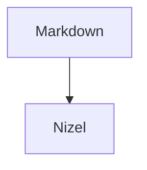
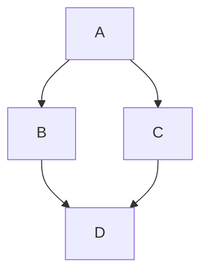

# nizel-plugin-diagrams

Diagram code block containers for [Nizel](https://npmjs.com/package/nizel).

The plugin turns explicit diagram code fences into renderer-friendly HTML containers. It does not bundle a diagram renderer; for Mermaid, load Mermaid in the host app and initialize it over `.mermaid` elements.

Only fences marked with `mermaid` are converted. Other code fences are left for the active code renderer, so this plugin can be combined with Shiki and code-copy.

The browser build exposes `NizelDiagrams` from `dist/diagrams.iife.js`.

## Install

```bash
npm install nizel-plugin-diagrams
```

## Usage

```ts
import { useNizel } from 'nizel';
import { diagramsPlugin } from 'nizel-plugin-diagrams';

const nizel = useNizel({
  plugins: [diagramsPlugin()],
});
```

## Syntax

````md

````

The language marker is required:

````md

````

## Options

| Option | Type | Default | Description |
| --- | --- | --- | --- |
| `mermaid` | `boolean` | `true` | Render Mermaid fences as diagram containers. |
| `className` | `string` | `'mermaid'` | CSS class used for Mermaid containers. |

## Output

```html
<div class="mermaid">flowchart TD...</div>
```

Non-diagram code fences continue to render as normal code blocks.

## License

MIT
